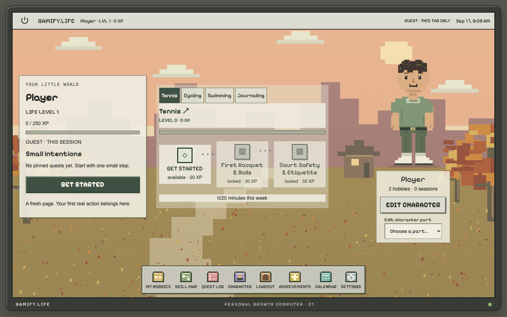
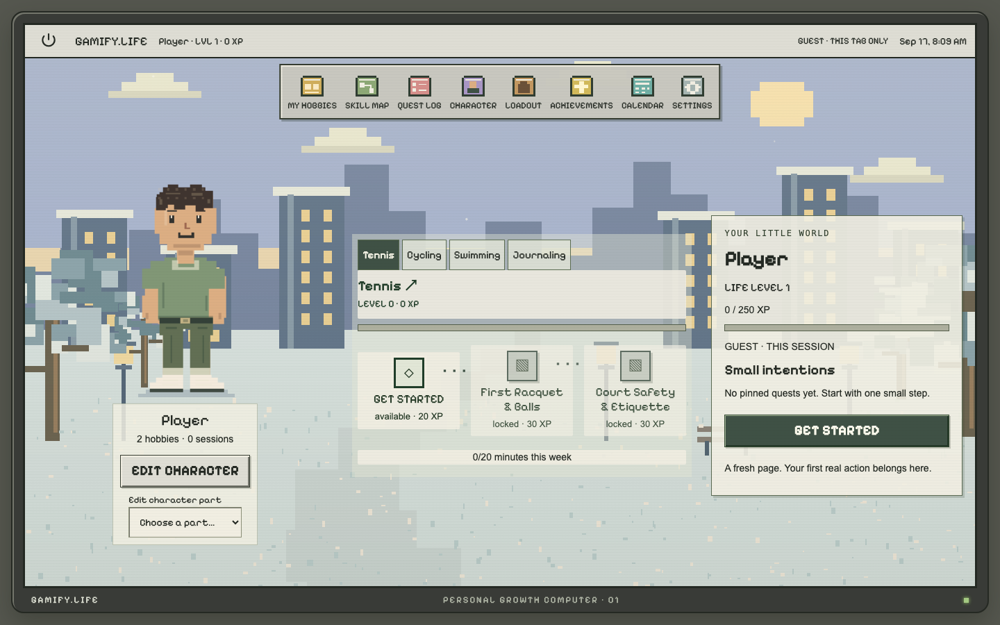
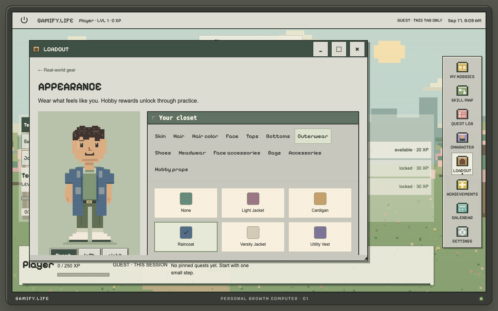
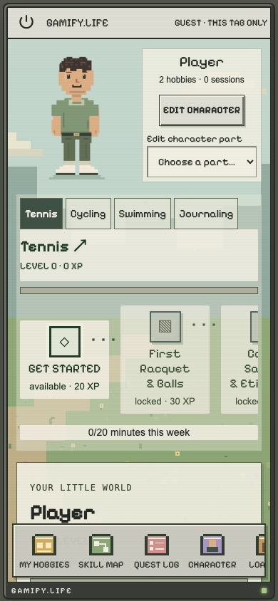

# Gamify.Life

> **Continuing this project?** Read [CONTINUE_HERE.md](docs/CONTINUE_HERE.md). The current branch includes a September 17, 2026 character-centered homepage work-in-progress checkpoint. The feature list and screenshots below describe the earlier stable retro checkpoint; the continuation guide distinguishes current changes, test evidence, and unfinished work.

A cozy Macintosh-inspired progression app for Tennis, Cycling / Fixed Gear, Swimming, and Journaling. Built from `GamifyLife_Codex_Build_Spec.md` with 72 canonical skills and hand-authored draft lessons.

## Run locally

Prerequisites: Node.js 22.12+ (Node 24 recommended), pnpm 11.

```sh
pnpm install --frozen-lockfile
cp .env.example .env.local
pnpm dev
```

Open http://127.0.0.1:3000. Choose **CONTINUE AS GUEST**, acknowledge the session warning, create a character, then choose hobbies. No external credentials are needed. Guest progress begins at zero XP and uses sessionStorage: refreshes keep it, but closing the tab/session ends it. Browser session restoration can restore sessionStorage; use Power → Close guest session for explicit deletion. Existing legacy localStorage demo data is left untouched and is not silently imported.

```sh
pnpm seed:validate
pnpm typecheck
pnpm lint
pnpm test
pnpm exec playwright install chromium
pnpm test:e2e
pnpm build
pnpm start
```

TypeScript 6 is used because the current ESLint TypeScript parser does not support TypeScript 7. The lockfile fixes compatible dependency versions. `lint` uses ESLint directly: Next.js 16 removed `next lint`.

## What works

- Boot/login flow, character-first onboarding with resume guards, session-only guests, and an original pixel desktop.
- Eight application launchers, independent dock/dashboard edges, a dashboard–nodes–character desktop, one instance per app, draggable/resizable windows, measured maximize/restore, minimize/close, and Reset Window Layout. Mobile uses full-screen apps and a bottom dock.
- Month calendar with movable/removable practice plans, logged sessions, daily rewards, current weekly quest progress and a suggested next action.
- All 72 skills, canonical AND/OR dependencies, explicit mandatory safety gates, direct lesson URLs, React Flow pan/zoom/fit controls, filters and accessible mobile journey view.
- Honor, count, duration and note evidence; one-time completion, optional mastery, XP ledger, hobby levels and life levels.
- Four flexible weekly quests, maximum three pins, one quest XP award per week, private practice logs. Repeat practice awards 20 XP per hobby per UTC day. Weekly periods begin Monday at 00:00 UTC; unfinished goals can restart with no penalty.
- Six achievements, cosmetic unlocks, original 128×192 layered pixel avatar, 13 equipment/identity slots, 12 skin tones, 16 hair styles, pose inspection, direct painted-layer editing, and milestone props including a fountain-pen sword, descriptive category stats, owned/borrowed gear and wishlist.
- Four original seasonal scenes with live previews, Apply/Cancel, bounded ambient animation, Off/Low/Normal intensity, and hidden/maximized-window pausing.
- Two-decision Quick Start, concise First Quest cards, and expandable gear/safety/resources.
- Reduced motion (including OS preference), opt-in chime, switchable screen texture, larger text, skip boot, theme, JSON export, guarded reset, sign-up/sign-in, account deletion.

## Supabase setup

1. Create a **development Supabase project**.
2. Apply both SQL files in `supabase/migrations/` in numeric order with the SQL editor or CLI. Migration 002 adds milestone cosmetic rules and active-hobby projection updates.
3. Apply `supabase/seed.sql`. Regenerate after editorial changes with `pnpm seed:sql`.
4. Set `.env.local`:

```dotenv
NEXT_PUBLIC_APP_MODE=cloud
NEXT_PUBLIC_SUPABASE_URL=https://YOUR-PROJECT.supabase.co
NEXT_PUBLIC_SUPABASE_ANON_KEY=YOUR-PUBLIC-ANON-KEY
SUPABASE_SERVICE_ROLE_KEY=YOUR-SERVER-ONLY-SERVICE-ROLE-KEY
FEATURE_AI_COACH=false
```

5. Set Supabase Auth's Site URL to your origin and allow `http://127.0.0.1:3000/auth/callback` plus your deployed `/auth/callback` URL. Keep email confirmation enabled; configure email delivery as appropriate.
6. Restart Next.js. Create and confirm an account. Authenticated sessions use the cloud adapter. Signing out returns to the login screen. A valid authenticated session selects cloud persistence; Continue as Guest selects the session-only adapter.

Never prefix the service-role key with `NEXT_PUBLIC_`, commit it, or enter it into the browser. Account deletion cascades through all private tables. Guest-to-account merging is not implemented. SAVE PROGRESS explains this rather than implying migration exists.

### Cloud storage and integrity

`ProgressRepository` exposes typed domain commands and read/export operations. Both adapters run the same pure progression engine. Progress mutations use the repository, which stores guests in sessionStorage and serializes writes with Web Locks where available. Guest sessions are independent between fresh tabs. Boot/session markers are sessionStorage-only. Auth tokens are managed separately by Supabase.

For cloud writes, `/api/progress` verifies the bearer token with Supabase Auth, validates every command with Zod, loads the private aggregate, evaluates progression and rewards, then calls a service-only Postgres transaction. An advisory lock and revision compare-and-swap protect concurrent first saves, completions, XP, quests and achievements. Conflicting commands are re-evaluated against the latest revision. One-time ledger keys are derived by the engine, never supplied by the browser. Offline cloud mutations are not queued; the page retains loaded content and displays a retryable error.

**Deliberate schema adaptation:** the private `progress_snapshots` JSONB aggregate is authoritative, with normalized private projections for profiles, enrollments, progress, XP ledger, quests, practice, gear, avatar and achievements. Desktop preferences, window geometry and calendar plans are persisted in the same private aggregate. Editorial content is UUID-keyed and stored in structured JSONB rather than dozens of separate lesson columns. The app ships a versioned content bundle; editing database content alone does not change the current client. Update the content bundle, regenerate SQL, and redeploy. Published content is read-only to anonymous/authenticated clients. All private tables enable RLS; clients can read only their own rows and cannot directly write rewards. Server writes are stricter than the spec's general user CRUD policy to prevent forged XP.

### Verify row isolation

The real two-account test is opt-in and **must point at a disposable development project**. It creates two temporary users and deletes them afterward:

```sh
TEST_SUPABASE_URL=... \
TEST_SUPABASE_ANON_KEY=... \
TEST_SUPABASE_SERVICE_ROLE_KEY=... \
pnpm test
```

Without those variables the RLS integration test is explicitly skipped. Running local unit/browser tests does not certify live cloud isolation. Do not claim production readiness before running this test and completing an email sign-up/sign-in/cloud-save/account-deletion smoke test against your actual deployment.

## Deploy on Vercel

1. Push this repository to your Git host and import it in Vercel as a Next.js project.
2. Use `pnpm install --frozen-lockfile` and `pnpm build`; Node 24.
3. Add the Supabase environment variables in Vercel, including the server-only service-role key. Deploy migrations and seed before enabling cloud mode.
4. Add the deployed origin and `/auth/callback` to Supabase Auth's allowed URLs.
5. Verify sign-up, sign-in, cloud persistence, account deletion, and two-user isolation.

Without Supabase variables, the deployment is fully functional in temporary guest mode. No deployment credentials are stored or assumed in this repository.

## Content and accessibility

Canonical node tables: `content/nodes.json`; authored lessons: `content/lessons.ts`; hobbies: `content/hobbies.json`. `lib/content.ts` validates and combines these with gear, quest, achievement and avatar catalogs. To add a hobby, add its content and catalog entry, then validate the graph.

All lessons visibly say **Curated draft**, not expert-reviewed. Resources are general organization reference links, clearly marked as awaiting lesson-specific review. Instructional and safety content needs qualified editorial review before wider public release. There are no medical claims, AI-generated runtime trees, social features, purchasing links, tracking analytics, punitive streaks or gear scores. Private notes are never sent to analytics.

The avatar is an original inline SVG layer compositor using a shared 128×192 pixel canvas. Selections are stable item IDs. Assets are code-native so palettes and layers remain editable without image tooling. Application icons and four layered seasonal landscapes are original code-native art. Reproduce the deterministic landscapes with `python3 scripts/create-season-art.py`. Only the selected scene loads on the desktop; Settings loads the four miniature previews. Avatar pixels are inline and use native painted-shape hit testing, with touch and keyboard alternatives. Pixelify Sans is locally hosted under the SIL Open Font License (see `public/fonts/OFL.txt`). PWA metadata is included; a service worker and guaranteed offline reload are not implemented.

## Project layout

- `app/`: Next.js route shell, responsive theme, authenticated API handlers.
- `components/`: Macintosh windows, dashboard, skills, avatar and personal screens.
- `lib/progression.ts`: pure progression rules and command reducer.
- `lib/repositories/`: interchangeable local and Supabase adapters.
- `content/`: canonical nodes, hobbies, editorial lessons.
- `supabase/`: migration and generated seed SQL.
- `tests/`: progression/component tests, optional two-user RLS integration, desktop/mobile browser tests.

The legacy one-time `scripts/import-spec.py` reproduces the original node-table import from the supplied document; it is not needed for setup. Future content edits should modify the versioned content files directly.

## Latest verification

See [the verification report](docs/VERIFICATION.md) for retro redesign checkpoints, test results, fixed issues, and remaining cloud checks. The normal unit suite also runs the actual PostgreSQL migration and RLS checks locally with PGlite; external Supabase credentials are only needed for the hosted integration test.

## Design checkpoint

Checkpoint branch: `design/character-centered-home` · intended tag: `v0.2-retro-desktop-checkpoint`.
This checkpoint includes the working retro desktop, responsive three-zone home, seasonal scenery, expanded avatar, quick-start flow, and existing progression engine. Future character-centered homepage experiments, expandable hobby constellations, nine body-type combinations, modular perspective backgrounds, and further sprite work should be developed after this recovery point.

The original project documents are retained without editing:

- [Build specification](docs/GamifyLife_Codex_Build_Spec.md)
- [Retro OS design handoff](docs/GamifyLife_Retro_OS_Design_Handoff.md)
- [Responsive, seasons, and character polish report](docs/GamifyLife_Responsive_Seasons_Character_Polish_Report.md)
- [Verification and limitations](docs/VERIFICATION.md)

### Screenshots

These are intentionally versioned screenshots of the original application, captured with an isolated test character. They contain no personal progress or uploaded reference artwork. Other browser-test screenshots and build artifacts stay ignored.









## Original assets and reproducibility

The desktop wallpapers are procedural scenes drawn in code (`lib/wallpapers/`), and `lib/sprites.ts` holds the original pixel icons and frames. `components/avatar.tsx` contains original pixel artwork. The locally hosted Pixelify Sans font is third-party licensed material, distributed with its SIL OFL license. No uploaded reference artwork is included.

Database migrations, generated seed data, `pnpm-lock.yaml`, and the empty `.env.example` configuration template are tracked. Local `.env` files, installed dependencies, build output, browser traces, and temporary screenshots are ignored.
