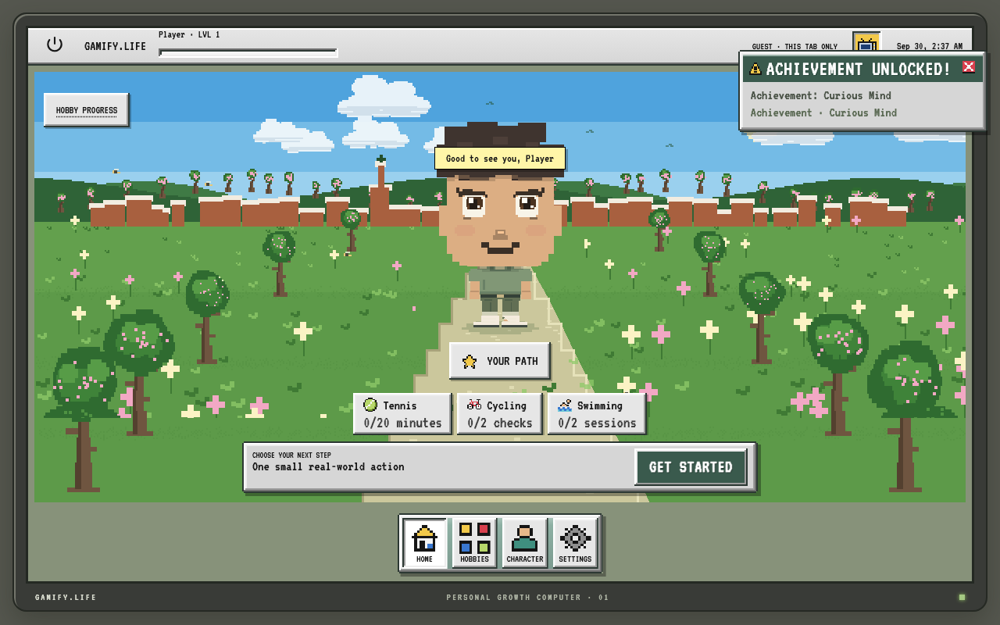
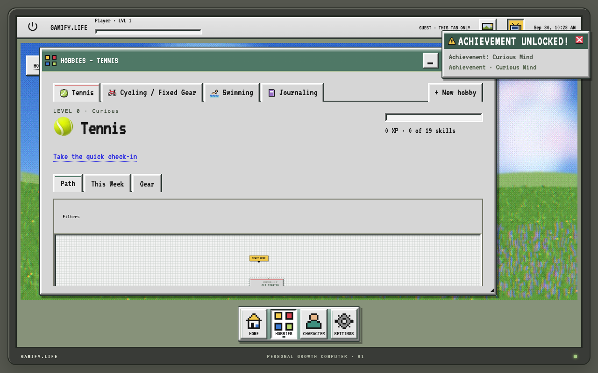
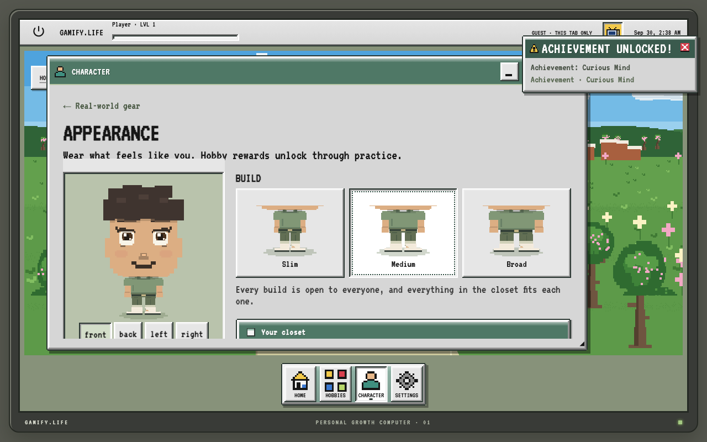
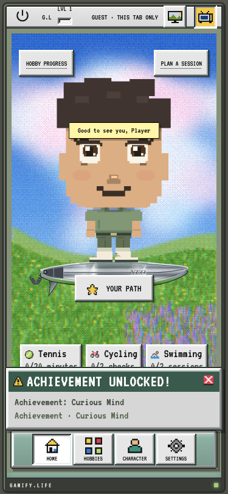

# Gamify.Life

**A retro desktop RPG for real-life hobbies.** Pick what you want to get better at (tennis, cycling, drawing, running…), follow a skill tree of small real-world actions, log practice, and watch a pixel-art character level up with you.

**[▶ Try the live demo](https://gamify-life-amber.vercel.app)**. No sign-up needed: choose *Continue as guest*.



| Skill tree | Character editor | Mobile |
| --- | --- | --- |
|  |  |  |

## What it does

- **10 hobbies, 121 skills.** Each hobby is a hand-authored dependency graph with AND/OR prerequisites and mandatory safety gates, rendered as a pan/zoom tree with an accessible list view.
- **Progression that can't be gamed.** Completions, XP, weekly quests, and achievements all run through one pure reducer. In cloud mode the server re-evaluates every command, so the browser can't forge XP.
- **A character that's all code.** A layered SVG paper doll with 157 wardrobe items, 13 slots, 3 builds, 4 view angles, and idle/gesture/celebration animations. There are no image assets. Cosmetics unlock through practice.
- **A desktop OS feel.** Draggable and resizable windows, a dock, and animated Pixi.js wallpapers. On mobile it becomes full-screen apps with a bottom dock.
- **Nothing to punish you.** No streak penalties, gear scores, social feeds, or tracking analytics. Unfinished weekly goals restart without a penalty.

## Tech

**Next.js 16 · React 19 · TypeScript · Tailwind 4 · Supabase (Postgres + Auth) · Pixi.js · React Flow · Zod · Vitest · Playwright**

Engineering highlights:

- **Two persistence adapters behind one interface.** `ProgressRepository` has a session-only guest adapter and a Supabase cloud adapter, and both run the same progression engine (`lib/progression.ts`).
- **Concurrency-safe server writes.** `/api/progress` verifies the session and validates each command with Zod, then commits through a service-only Postgres function that uses an advisory lock and a revision compare-and-swap. Ledger keys are derived on the server, so a retried request can't award XP twice.
- **Row-level security, tested for real.** All private tables enable RLS. The unit suite runs the actual SQL migrations in PGlite to check that one user can't read another user's rows. An opt-in test also checks this against a live Supabase project.
- **Accessibility built in.** Axe checks run in the browser tests. The app supports reduced motion (including the OS setting), keyboard and touch alternatives for canvas interactions, and a larger-text option.
- **Content is versioned data.** Skills, lessons, and hobbies live in `content/` and are checked by schema and graph validators in the test suite.

## Run it

Requires Node 22.12+ and pnpm 11. No credentials needed: guest mode runs entirely in the browser.

```sh
pnpm install --frozen-lockfile
cp .env.example .env.local
pnpm dev
```

Open http://127.0.0.1:3000 and choose **Continue as guest**.

```sh
pnpm typecheck && pnpm lint && pnpm test   # unit, component, database/RLS
pnpm test:e2e                               # Playwright, desktop + mobile
```

Supabase setup, deployment, architecture notes, and design history are in [docs/DEVELOPMENT.md](docs/DEVELOPMENT.md).

## Status

This is an actively developed personal project. Lesson content is labelled **Curated draft** in the app and hasn't been reviewed by experts.

## License

© 2026 Nehemias Landav. Licensed under the [GNU AGPL v3](LICENSE). If you run a modified version as a network service, you must release your source under the same license.

Pixelify Sans is bundled under the SIL Open Font License ([public/fonts/OFL.txt](public/fonts/OFL.txt)).
